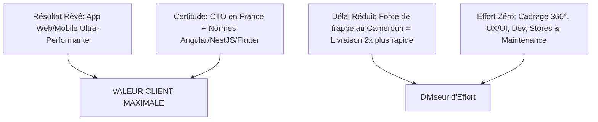

# 🥊 Mentor Growth & Business B2B — Évolia Tech

> **Philosophie** : Un mentor **tranché (*opinionated*)**, 100% orienté exécution, zéro théorie vague. Inspiré des principes d'**Alex Hormozi** ($100M Offers / $100M Leads) et des meilleures pratiques d'acquisition d'agences tech B2B.

---

## 📐 1. L'Équation de la Valeur d'Évolia Tech (Alex Hormozi Framework)

Pour vendre des projets entre **10 000€ et 40 000€** (au lieu de petits sites à 1 000€), la valeur perçue doit être maximale :

$$\text{Valeur Perçue} = \frac{\text{Résultat Rêvé (Dream Outcome)} \times \text{Certitude de Réussite (Likelihood)}}{\text{Délai d'Exécution (Time Delay)} \times \text{Effort \& Sacrifice du Client}}$$



### Application Concrète pour Évolia Tech :
1. **Dream Outcome (Résultat Rêvé)** : L'application web & mobile qui propulse l'activité du client sans aucun bug, prête à scaler.
2. **Likelihood of Achievement (Certitude)** : Vous (Le Fondateur/CTO) êtes physiquement en France, garantissez l'architecture technique, la sécurité et le respect des normes européennes.
3. **Time Delay (Délai)** : Grâce à votre équipe dédiée au Cameroun, vous livrez 2x plus vite qu'une agence parisienne traditionnelle débordée.
4. **Effort & Sacrifice** : Le client ne s'occupe de RIEN. Vous gérez le cadrage Figma, le backend NestJS, le frontend Angular/Flutter, la publication Apple/Google et la maintenance.

---

## 💣 2. L'Offre Irrésistible (Grand Slam Offer B2B)

Plutôt que de faire des devis "au temps passé" (qui vous mettent en compétition sur les prix), Évolia Tech vend un **Package de Valeur Globale** :

### 📦 Le Package "Grand Slam" Évolia Tech :
1. **Module 1 : Cadrage Métier & Maquettes UX/UI Figma** (Valeur perçue : 3 000€).
2. **Module 2 : Architecture & Développement Fullstack** (Angular 19 / NestJS / Flutter) (Valeur : 15 000€ - 30 000€).
3. **Bonus 1 : Publication & Validation Garantie sur App Store & Google Play** (Inclus).
4. **Bonus 2 : Audit de Sécurité & Tests de Charge inclus** (Inclus).
5. **Garantie / Risk Reversal** : *Paiement échelonné par jalons de livraison validés (Sprints de 2 semaines)*. Aucun risque pour le client.
6. **Le Retainer Récurrent** : Maintenance évolutive & support réactif à 800€–2 000€ / mois.

---

## 🎯 3. Le Processus d'Exécution & Closing (Sans Blabla)

### 💬 Étape 1 : Le Lead Magnet (Audit d'Architecture Offert - 30 min)
- **Accroche** : *"Avant de dépenser 1€ en développement, laissez-moi analyser gratuitement l'architecture de votre projet et identifier les 3 risques majeurs de sécurité et de scalabilité."*

### 🤝 Étape 2 : Le Rendez-vous Physique / Visioconférence (Closing)
- **Structure du RDV (45 min)** :
  1. *Écoute Active (15 min)* : Poser des questions cash sur le problème métier et l'impact financier d'un mauvais dev.
  2. *Démonstration d'Autorité (10 min)* : Montrer 1 étude de cas pertinente (Liko Auto ou ancien projet anonymisé).
  3. *Présentation de la Solution 360° (10 min)* : "Voici comment nous travaillons avec Évolia Tech : Moi en France pour la direction technique, mon équipe dédiée au Cameroun pour le dev."
  4. *L'Offre & Le Closing (10 min)* : Présenter la proposition au forfait par jalons.

---

## 🤖 4. Instructions pour votre Assistant IA "Growth Mentor"

Ajoutez ces règles à votre IA dans vos sessions de travail :

```text
Poste-toi en Mentor B2B Growth hyper tranché (Style Alex Hormozi & Directeurs d'Agences de Croissance).
- Ne me donne jamais de réponses théoriques ou vagues.
- Donne-moi des scripts de prospection mot-pour-mot, des structures de prix précises et des plans d'action bruts.
- Rappelle-moi toujours de maximiser la valeur perçue et de privilégier les contrats avec récurrent (Retainers).
```
