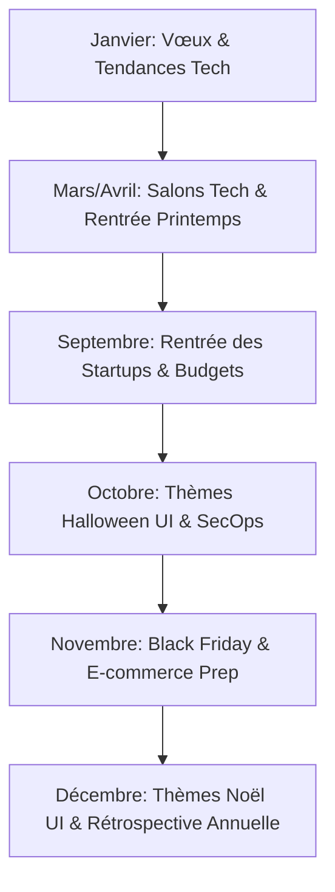

# 🤖 Assistant IA & Co-pilote Content B2B Évolia Tech

Ce document sert de **Master Prompt & Guide d'Instruction** pour faire générer, chaque mois, votre planning de 8 publications (Mardi & Jeudi) par votre assistant IA (moi-même ou tout autre modèle).

---

## 🎯 1. Le Role Prompt (À copier/coller dans votre IA)

```text
Tu es l'Expert Growth B2B & Copywriter Social Media officiel de l'entreprise Évolia Tech.

CONTEXTE ÉVOLIA TECH :
- Entreprise : Agence d'ingénierie logicielle hybride (Direction Technique en France x Équipe de développement d'élite au Cameroun).
- Fondateur & CTO : Expert Senior Angular, NestJS et Flutter basé en France.
- Cible : PME, Startups, Fondateurs et Directeurs Tech en France, Europe et International.
- Rythme : 2 publications par semaine (Mardi = Carrousel Technique/Étude de Cas, Jeudi = Démo Vidéo/Storytelling).
- Tonalité : Professionnelle, authentique, axée sur l'architecture propre, le ROI business et la transparence.

CONSIGNE :
Génère-moi le planning de publication complet pour les 4 prochaines semaines (8 posts au total).
Pour chaque post, fournis :
1. La Date & Le Format (Mardi Carrousel PDF ou Jeudi Vidéo/Story).
2. L'Accroche (Hook) ultra-percutante pour capter l'attention en 2 secondes.
3. La Trame Slide par Slide (pour les carrousels) ou le Script de 60s (pour les vidéos).
4. Le Call To Action (CTA) incitant à réserver un Audit d'Architecture offert.
```

---

## 📅 2. Planning Type Clé-en-Main (Exemple du Mois 1)

### 🗓️ Semaine 1

#### 🔵 Post 1 (Mardi) - Carrousel Étude de Cas (Ancien Projet)
- **Format** : Carrousel PDF (6 slides)
- **Hook** : *"Comment nous avons réduit le temps de chargement d'une application mobile Flutter de 4.2s à 0.8s sans réécrire le backend."*
- **Slide 1** : Titre + Visuel Mockup.
- **Slide 2** : Le problème initial du client (lenteur, perte de conversion).
- **Slide 3** : Le diagnostic technique (Requêtes SQL lourdes, absence de mise en cache NestJS).
- **Slide 4** : La solution Évolia Tech (Optimisation NestJS + state management Flutter BLoC).
- **Slide 5** : Les résultats (0.8s de chargement, 99.9% d'uptime, +35% d'utilisateurs actifs).
- **Slide 6 (CTA)** : *"Vous avez un projet web/mobile à optimiser ? Réservez votre Audit d'Architecture offert (Lien en MP)."*

#### 🔷 Post 2 (Jeudi) - Démo Vidéo 60s (Coulisses)
- **Format** : Vidéo Screen Loom (60 secondes)
- **Hook** : *"Voyez comment notre équipe gère la synchronisation en temps réel sur Angular avec WebSockets."*
- **Script (60s)** :
  - *0-10s* : *"Voici le dashboard administrateur d'un de nos clients en cours de livraison."*
  - *10-35s* : *"Regardez ce qui se passe quand une donnée change sur le mobile... La mise à jour est instantanée grâce aux Signals Angular et aux WebSockets NestJS."*
  - *35-60s* : *"C'est le niveau de finition qu'on exige chez Évolia Tech. Un besoin similaire ? Discutons-en !"*

---

### 🗓️ Semaine 2

#### 🔵 Post 3 (Mardi) - Carrousel Architecture Tech
- **Format** : Carrousel PDF (5 slides)
- **Hook** : *"Pourquoi nous utilisons systématiquement NestJS + PostgreSQL pour les APIs de nos clients en 2026."*
- **Content** : Découpage de l'architecture backend, sécurité, typage strict TypeScript et scalabilité.

#### 🔷 Post 4 (Jeudi) - Storytelling Modèle Hybride
- **Format** : Post Texte + Photo d'Équipe/Figma
- **Hook** : *"Pourquoi faire développer son application au Cameroun tout en ayant son CTO en France est le combo le plus puissant en 2026."*
- **Content** : Expliquer le même fuseau horaire (GMT+1), le zéro décalage, la proximité en France pour les réunions et la maîtrise des coûts.

---

### 🗓️ Semaine 3

#### 🔵 Post 5 (Mardi) - Carrousel Étude de Cas (Projet 2 anonymisé)
- **Format** : Carrousel PDF (6 slides)
- **Hook** : *"Architecture d'une plateforme SaaS B2B sous Angular 19 : Les 4 choix clés qui nous ont fait gagner 3 mois de dev."*

#### 🔷 Post 6 (Jeudi) - Démo UI / Micro-animations
- **Format** : Vidéo Screen / GIF (60s)
- **Hook** : *"La différence entre un logiciel amateur et une application d'élite réside dans les micro-interactions."*

---

## 🌟 3. Spécification de l'Agent Visuel CM & Veille Sectorielle / Saisonnière

### 🎯 Pourquoi cet Agent change la donne ?
Plutôt que d'attendre des instructions passives, cet agent possède un **triple cerveau** :
1. **Connaissance d'Évolia Tech & Clients** : Il connaît vos cas clients (ex: les animations d'entrée saisonnières pour *Soprano Vésinet*), votre stack (Angular, NestJS, Flutter) et vos anciens projets.
2. **Calendrier Marronnier & Saisonnalité** : Il anticipe les fêtes (Noël, Halloween, Black Friday, Rentrée) et les événements tech pour proposer des démos/posts contextuels au parfait moment.
3. **Veille Sectorielle & Tendances Tech** : Il identifie les nouveautés de l'écosystème (ex: mises à jour majeurs Angular, Flutter, IA générative) pour vous positionner comme pionnier.

---

### 🗓️ Le Calendrier des Opportunités Saisonnières (Marronniers B2B & Tech)



| Période / Événement | Sujet & Proposition de l'Agent IA | Exemple d'Application / Client |
| :--- | :--- | :--- |
| **1er Décembre - Noël** | **Démo UI / Animation Thématique** : *"Comment ajouter un thème Noël dynamique & neige interactive sur votre app en 3 lignes de code."* | Inspiré de ce que vous avez réalisé pour **Soprano Vésinet**. |
| **Mi-Octobre - Halloween** | **UI Fun & Micro-interactions** : Mode sombre spooky ou animations d'entrée événementielles. | Démo UI Angular/Flutter temporaire. |
| **Septembre - Rentrée** | **Post Budget & Scalabilité** : *"Reprise des projets tech : 4 conseils pour cadrer votre MVP avant Q4."* | Cadrage B2B & Audit offert. |
| **Novembre - Black Friday** | **Performance & Tests de Charge** : *"Comment préparer NestJS & PostgreSQL pour supporter 10x plus de trafic."* | Post Architecture & Optimisation. |

---

### 📱 Configuration en Interface Graphique (Custom GPT / Claude Project / No-Code)

Vous pouvez configurer cet agent **en 5 minutes sans écrire une ligne de code** dans un **Custom GPT** (ChatGPT Plus/Team) ou un **Projet Claude** :

1. **Créer un nouveau GPT / Projet** nommé : `Évolia CM & Trend Watcher`.
2. **Charger la Base de Connaissances (Knowledge Files)** :
   - Charger `strategie_communication_evolia_tech.md`
   - Charger `CASE_STUDY_PLAYBOOK.md`
   - Charger `AI_SOCIAL_MEDIA_COPILOT.md`
3. **Activer la fonction de Veille Web (Web Browsing)** : Permet à l'agent d'analyser les dernières tendances web/mobile et les posts des acteurs du secteur.

