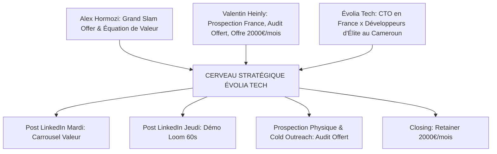

# 🧠 Le Cerveau Stratégique des Mentors — Évolia Tech

Ce document est la **base de connaissances unifiée** combinant les frameworks d'**Alex Hormozi** ($100M Offers / Leads), les tactiques d'agences françaises de **Valentin Heinly** (AGS), et les méthodes d'ingénierie B2B d'**Évolia Tech**.

---

## ⚡ 1. Mentor 1 : Alex Hormozi ($100M Offers & Leads)

### 🎯 Le Cœur de la Stratégie :
- **L'Équation de la Valeur** : Maximiser le résultat rêvé et la certitude / Réduire le délai et l'effort client.
- **Grand Slam Offer** : Packager des offres à valeur perçue massive (pas de vente d'heures dev).
- **Core 4 Lead Generation** : 
  1. *Warm Outreach* (Réseau & contacts directs).
  2. *Cold Outreach* (Prospection à froid ultra-ciblée).
  3. *Free Content* (Carrousels LinkedIn & démos Loom).
  4. *Paid Ads* (Publicité ciblée une fois la rentabilité validée).

---

## 🇫🇷 2. Mentor 2 : Valentin Heinly (AGS - Agence Système)

### 🎯 Le Cœur de la Stratégie :
- **Transition vers le Récurrent** : Objectif **2 000 € / mois** par client sous forme de contrat Partenaire Tech (Retainer / Maintenance évolutive).
- **La Démonstration Spéculative & Audit Offert** : Ouvrir la porte aux prospects PME avec un **Audit d'Architecture Offert de 30 min** ou une démo vidéo personnalisée.
- **Méthodologie de Closing B2B** :
  - RDV 1 : Découverte & Diagnostic des douleurs du client.
  - RDV 2 : Présentation de l'Offre au forfait par jalons + Closing sans négociation de prix.

---

## 🧩 3. La Fusion Unifiée d'Évolia Tech (Le Combo Imbattable)

---

## 👥 5. Fiche Équipe Évolia Tech & Mises à Jour de Recrutement

### 🎯 Composition Actuelle de l'Équipe :
- **Fondateur & Direction Technique (France)** : Vous (Architecte Senior Angular, NestJS, Flutter). Cadrage, suivi client, garantie d'architecture et closing.
- **Équipe de Réalisation (Cameroun - Douala/Yaoundé)** : Ingénieurs passionnés spécialisés sur le stack Angular 19, NestJS, Flutter & Firebase/PostgreSQL.

### 📢 Protocoles de Mises à Jour & Recrutements :
Chaque fois que vous recrutez un nouveau talent (développeur, UI/UX designer, chef de projet) :
1. **Mettre à jour ce fichier** (ajouter le rôle et le prénom).
2. **Demander à Gemini de générer le Post de Recrutement / Célébration** :
   - *Hook Type* : *"Évolia Tech grandit ! Nous accueillons [Prénom] au poste de [Rôle] dans notre pôle de réalisation à Douala. Grâce à cette arrivée, nous accélérons les livraisons pour nos clients."*
   - *Impact* : Montrer la croissance de l'agence renforce la preuve sociale et la certitude des prospects B2B ($100M Offers Likelihood).

